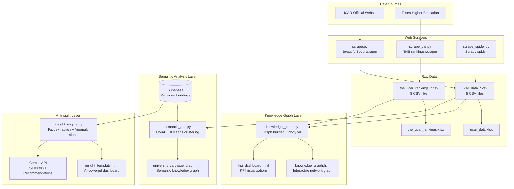

# UCAR Data Pipeline Architecture

## Overview
This project scrapes data from UCAR (University of Carthage) and Times Higher Education, then builds knowledge graphs and AI-powered insights.

## System Architecture

## Core Components

### 1. Data Collection Layer
- **scrape.py**: BeautifulSoup-based scraper for UCAR website
- **scrape_spider.py**: Scrapy spider for crawling UCAR pages
- **scrape_the.py**: Scraper for Times Higher Education rankings

### 2. Data Storage Layer
- **CSV Files**: 13 total CSV files (5 UCAR + 8 THE rankings)
- **Excel Files**: Consolidated data in .xlsx format
- **Supabase**: Vector embeddings for semantic search

### 3. Knowledge Graph Layer
- **knowledge_graph.py**: Builds entity-relationship graphs from CSV data
- **knowledge_graph.html**: Interactive Plotly network visualization
- **kpi_dashboard.html**: Key performance indicators dashboard

### 4. Semantic Analysis Layer
- **semantic_app.py**: UMAP dimensionality reduction + KMeans clustering
- **university_carthage_graph.html**: Semantic knowledge graph visualization
- **Supabase**: Stores document embeddings for vector search

### 5. AI Insight Layer
- **insight_engine.py**: Fact extraction, anomaly detection, correlation analysis
- **insight_template.html**: Interactive dashboard with AI-generated insights
- **Gemini API**: Synthesizes recommendations and causal chain analysis

## Data Flow

1. **Scrapers** fetch data from UCAR website and THE rankings
2. **Raw data** is saved as CSV/Excel files
3. **Knowledge graph builder** connects entities and relationships
4. **Semantic app** creates vector embeddings and clusters documents
5. **Insight engine** extracts facts, detects anomalies, generates AI insights

## Files to Commit

### Core Application
- scrape.py, scrape_spider.py, scrape_the.py
- knowledge_graph.py, semantic_app.py, insight_engine.py
- insight_template.html

### Data Outputs
- the_ucar_rankings_*.csv (8 files)
- ucar_data_*.csv (5 files)
- *.xlsx files
- knowledge_graph.html, kpi_dashboard.html, university_carthage_graph.html

### Documentation
- README.md, ARCHITECTURE.md, architecture.mmd
- .gitignore (protects API keys)

## Viewing the Architecture

The architecture diagram is available in two formats:
- **architecture.mmd**: Mermaid source file
- **ARCHITECTURE.md**: Markdown with embedded mermaid diagram

View online at: https://mermaid.live/ (paste contents of architecture.mmd)
