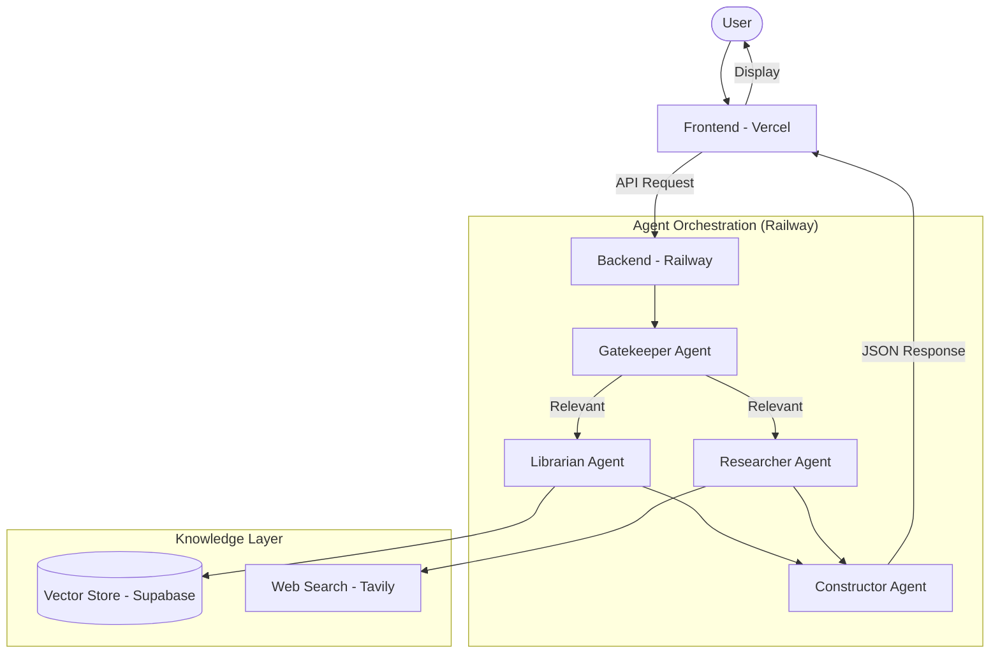

# UCAR Smart Query Engine

A multi-agent RAG (Retrieval-Augmented Generation) system designed for University Carthage (UCAR). It helps users navigate institutional documents and access key performance indicators (KPIs) through a collaborative agent architecture.

## Deployment Architecture

## Agents Overview

- **Gatekeeper:** Evaluates question relevance to UCAR and its 32 institutions. Prevents off-topic queries.
- **Librarian:** Performs semantic search across institutional documents stored in Supabase using local embeddings.
- **Researcher:** Accesses real-time data from the web via Tavily API to complement archived documents.
- **Constructor:** Synthesizes outputs from all agents into a professional response with citations and error handling.

## Tech Stack

- **Frontend:** React (Vercel)
- **Backend:** Flask / Python (Railway)
- **Large Language Model:** Groq (Llama 3.1)
- **Vector Database:** Supabase (pgvector)
- **Search API:** Tavily
- **Embeddings:** FastEmbed
- **Data Source:** PDF / Supabase Cloud
