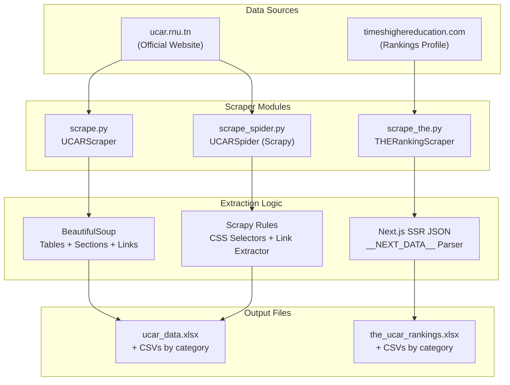
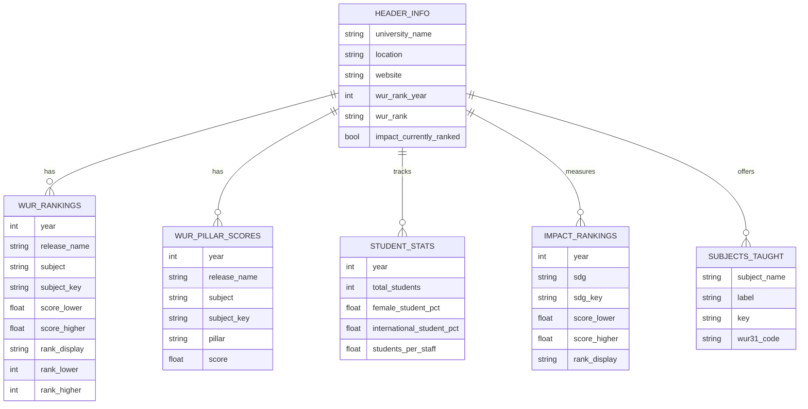
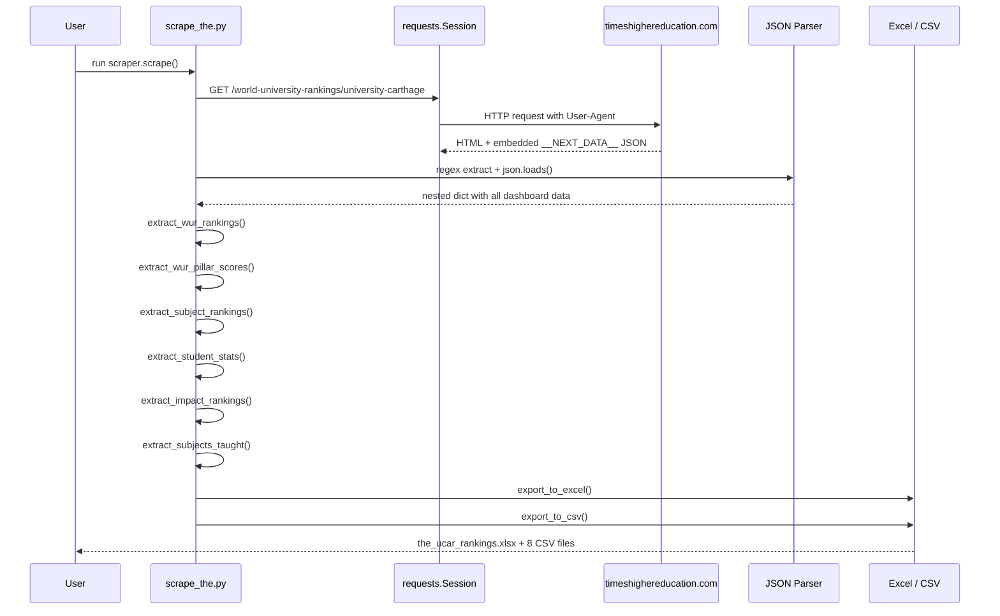

# UCAR & THE Rankings Data Scraping Suite

A collection of Python scrapers for extracting institutional data about the **University of Carthage** (UCAR) from its official website and **Times Higher Education (THE)** rankings profiles.

---

## Project Structure

| File | Description |
|------|-------------|
| `scrape.py` | UCAR website crawler — extracts tables, sections, and categorized institutional data (enrollment, academic, finance, HR, research, infrastructure, partnership). |
| `scrape_spider.py` | Scrapy-based spider for large-scale crawling of `ucar.rnu.tn`. |
| `scrape_the.py` | THE Rankings scraper — extracts KPIs, pillar scores, subject rankings, student statistics, impact rankings, and more from `timeshighereducation.com`. |
| `dynamiq_scraper.py` | Additional dynamic scraper for UCAR. |
| `ucar_data.xlsx / *.csv` | Output from `scrape.py` — UCAR institutional data by category. |
| `the_ucar_rankings.xlsx / *.csv` | Output from `scrape_the.py` — THE rankings data for University of Carthage. |

---

## Architecture



---

## `scrape.py` — UCAR Website Scraper

```python
scraper = UCARScraper(base_url="https://ucar.rnu.tn/")
pages = scraper.scrape(max_pages=100)
scraper.export_to_excel('ucar_data.xlsx')
scraper.export_to_csv('ucar_data')
```

**Extracts:**
- HTML tables (structured data)
- Sections matching keywords: `enrollment`, `academic`, `finance`, `hr`, `research`, `infrastructure`, `partnership`
- Auto-categorization into 8 buckets
- Internal link following with domain validation

**Output categories:** `enrollment`, `academic`, `finance`, `hr`, `research`, `infrastructure`, `partnership`, `general`

---

## `scrape_the.py` — THE Rankings Scraper

```python
scraper = THERankingScraper(
    profile_url="https://www.timeshighereducation.com/world-university-rankings/university-carthage"
)
scraper.scrape()
scraper.export_to_excel('the_ucar_rankings.xlsx')
scraper.export_to_csv('the_ucar_rankings')
```

**Extracts (no browser needed — all data from Next.js SSR JSON):**

| Category | Records | Description |
|----------|---------|-------------|
| `header_info` | 1 | University name, location, website, WUR rank |
| `about` | 1 | Full institutional description |
| `wur_rankings` | 46 | Subject-level rank bands per year (2020–2026) |
| `wur_pillar_scores` | **230** | **Dashboard pillar scores** — Teaching, Research Environment, Research Quality, Industry, International Outlook for every subject tab |
| `subject_rankings` | 7 | Subject-level rank ranges |
| `student_stats` | 7 | Yearly: total students, female %, international %, students/staff |
| `impact_rankings` | 54 | SDG scores and ranks (No Poverty, Zero Hunger, etc.) |
| `subjects_taught` | 28 | All subjects offered with WUR31 codes |

**Dashboards covered (all clickable tabs on THE page):**
- World University Rankings (Overall)
- Business and Economics
- Computer Science
- Engineering
- Life Sciences
- Physical Sciences
- Social Sciences

---

## THE Data Model (Mermaid ERD)



---

## Scraping Flow (THE)



---

## Requirements

```
requests
beautifulsoup4
pandas
openpyxl
scrapy
```

Install:
```bash
pip install requests beautifulsoup4 pandas openpyxl scrapy
```

---

## Usage

**UCAR Website:**
```bash
python scrape.py
```

**THE Rankings:**
```bash
python scrape_the.py
```

**Scrapy Spider:**
```bash
python scrape_spider.py
```

---

## Key Design Decisions

1. **No browser automation** — THE data is fully server-side rendered in a `<script id="__NEXT_DATA__">` JSON blob. Parsing it directly avoids Selenium/Playwright overhead.

2. **Single-request extraction** — All dashboard tabs (Overall, Business & Economics, Computer Science, Engineering, Life Sciences, Physical Sciences, Social Sciences) are embedded in the same JSON. One HTTP request captures everything.

3. **Pillar score extraction** — THE changed its schema between years (2020–2023 use `Research`/`Citations`, 2024–2026 use `Research Environment`/`Research Quality`). The scraper captures both sets.

4. **Rate limiting** — `scrape.py` uses 1-second delays; `scrape_spider.py` uses 0.5s `DOWNLOAD_DELAY`.

5. **Retry logic** — Exponential backoff with 3 attempts on connection errors.
