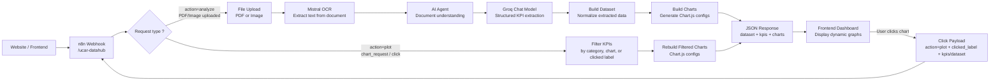

```mermaid
flowchart LR
    A["Website / Frontend"] --> B["n8n Webhook<br/>/ucar-datahub"]

    B --> C{"Request type ?"}

    C -- "action=analyze<br/>PDF/Image uploaded" --> D["File Upload<br/>PDF or Image"]
    D --> E["Mistral OCR<br/>Extract text from document"]
    E --> F["AI Agent<br/>Document understanding"]
    F --> G["Groq Chat Model<br/>Structured KPI extraction"]
    G --> H["Build Dataset<br/>Normalize extracted data"]
    H --> I["Build Charts<br/>Generate Chart.js configs"]
    I --> J["JSON Response<br/>dataset + kpis + charts"]

    C -- "action=plot<br/>chart_request / click" --> K["Filter KPIs<br/>by category, chart, or clicked label"]
    K --> L["Rebuild Filtered Charts<br/>Chart.js configs"]
    L --> J

    J --> M["Frontend Dashboard<br/>Display dynamic graphs"]
    M -- "User clicks chart" --> N["Click Payload<br/>action=plot + clicked_label + kpis/dataset"]
    N --> B
```
