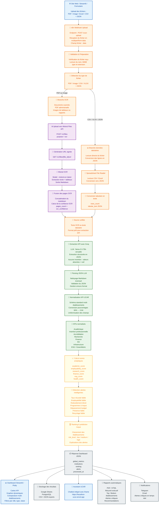

## Architecture UCAR DataHub AI

```mermaid
flowchart TD

    %% =========================
    %% FRONTEND LAYER
    %% =========================
    A["🌐 Site Web / Streamlit / Formulaire<br/><br/>Upload des fichiers :<br/>PDF • Image • Excel • CSV • JSON"] 
    B["📩 n8n Webhook Upload<br/><br/>Endpoint : POST /ucar-upload<br/>Réception du fichier en multipart/form-data<br/>Champ fichier : data"]

    A --> B

    %% =========================
    %% INGESTION LAYER
    %% =========================
    B --> C["🧩 Validation & Préparation<br/><br/>Vérification du fichier reçu<br/>Lecture du nom, MIME type et extension"]
    C --> D["🔎 Détection du type de fichier<br/><br/>PDF / Image / CSV / XLSX / JSON"]

    %% =========================
    %% BRANCHING
    %% =========================
    D -->|PDF ou Image| E["📄 Branche OCR<br/><br/>Documents scannés<br/>PDF administratifs<br/>Images de tableaux ou rapports"]
    D -->|CSV / XLSX / JSON| F["📊 Branche données tabulaires<br/><br/>Lecture directe du fichier<br/>Conversion des lignes en JSON"]

    %% =========================
    %% OCR BRANCH
    %% =========================
    E --> G["⬆️ Upload vers Mistral Files API<br/><br/>POST /v1/files<br/>purpose = ocr"]
    G --> H["🔗 Génération URL signée<br/><br/>GET /v1/files/{file_id}/url"]
    H --> I["🤖 Mistral OCR<br/><br/>Model : mistral-ocr-latest<br/>Extraction texte + tableaux<br/>Sortie Markdown"]
    I --> J["📝 Fusion des pages OCR<br/><br/>Concaténation du markdown<br/>Calcul de la confiance OCR<br/>pages_count + ocr_confidence"]

    %% =========================
    %% TABULAR BRANCH
    %% =========================
    F --> K["📑 Spreadsheet File Reader<br/><br/>Lecture CSV / Excel<br/>Conversion vers JSON"]
    K --> L["🧾 Conversion tabulaire en texte<br/><br/>rows_count<br/>tabular_text JSON"]

    %% =========================
    %% MERGE LOGIC
    %% =========================
    J --> M["🔀 Source unifiée<br/><br/>Texte OCR ou texte tabulaire<br/>Format prêt pour extraction KPI"]
    L --> M

    %% =========================
    %% AI EXTRACTION
    %% =========================
    M --> N["🧠 Extraction KPI avec Groq<br/><br/>LLM : llama-3.3-70b-versatile<br/>Extraction structurée en JSON<br/>Aucune invention : valeurs absentes = null"]

    N --> O["🧪 Parsing JSON LLM<br/><br/>Nettoyage Markdown éventuel<br/>Validation du JSON<br/>Gestion erreurs format"]

    %% =========================
    %% NORMALIZATION
    %% =========================
    O --> P["🧱 Normalisation KPI UCAR<br/><br/>Schéma standard multi-établissements<br/>Conversion pourcentages 84% → 0.84<br/>Uniformisation des champs"]

    P --> Q["📌 KPIs normalisés<br/><br/>Académique<br/>Insertion professionnelle<br/>Accréditation<br/>Recherche<br/>Finance<br/>RH<br/>Infrastructure<br/>ESG / GreenMetric"]

    %% =========================
    %% ANALYTICS
    %% =========================
    Q --> R["📈 Calcul scores analytiques<br/><br/>academic_score<br/>employability_score<br/>research_score<br/>finance_score<br/>esg_score<br/>health_score"]

    R --> S["🚨 Détection alertes intelligentes<br/><br/>Taux réussite faible<br/>Employabilité faible<br/>Redoublement élevé<br/>Programmes à risque<br/>Dépassement budget<br/>Présence faible<br/>Recyclage faible"]

    S --> T["🏆 Ranking & prédiction risque<br/><br/>Classement des établissements<br/>risk_level : low / medium / high<br/>Explications des alertes"]

    %% =========================
    %% OUTPUTS
    %% =========================
    T --> U["📦 Réponse Dashboard JSON<br/><br/>global_metrics<br/>institutions<br/>ranking<br/>alerts<br/>processed_at"]

    U --> V["📊 Dashboard Streamlit / Plotly<br/><br/>Cartes KPI<br/>Graphes dynamiques<br/>Comparaison multi-établissements<br/>Filtres par ville, type, statut"]
    
    U --> W["💾 Stockage des résultats<br/><br/>Google Sheets<br/>PostgreSQL<br/>CSV / JSON exports"]

    U --> X["🤖 Assistant UCAR<br/><br/>Chatbot intégré avec iframe<br/>https://hacathon-ucar.vercel.app"]

    U --> Y["📄 Rapports automatiques<br/><br/>PDF / HTML<br/>Résumé exécutif<br/>Top / Bottom établissements<br/>Alertes critiques<br/>Recommandations"]

    U --> Z["📲 Notifications<br/><br/>Telegram<br/>Email<br/>Alertes critiques en temps réel"]

    %% =========================
    %% STYLE
    %% =========================
    classDef frontend fill:#E3F2FD,stroke:#1565C0,stroke-width:2px,color:#0D47A1;
    classDef n8n fill:#FFF3E0,stroke:#EF6C00,stroke-width:2px,color:#E65100;
    classDef ocr fill:#F3E5F5,stroke:#7B1FA2,stroke-width:2px,color:#4A148C;
    classDef ai fill:#E8F5E9,stroke:#2E7D32,stroke-width:2px,color:#1B5E20;
    classDef analytics fill:#FFFDE7,stroke:#F9A825,stroke-width:2px,color:#F57F17;
    classDef output fill:#ECEFF1,stroke:#455A64,stroke-width:2px,color:#263238;

    class A,V,X frontend;
    class B,C,D,E,F,K,L,M n8n;
    class G,H,I,J ocr;
    class N,O,P,Q ai;
    class R,S,T analytics;
    class U,W,Y,Z output;
```
