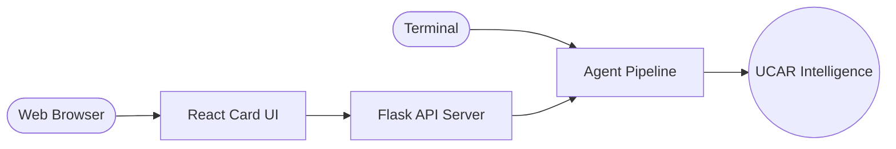

# UCAR Web Integration Guide

The UCAR Smart Query Engine has been successfully integrated with a premium React frontend. The system now works both in your terminal and in a modern web browser.

## Architecture Update



## How to Run the Full System

To run both the terminal version and the web version simultaneously:

### 1. Start the API Server (Backend)
In a new terminal, run:
```bash
python server.py
```
*This server acts as a bridge, allowing the web interface to use the same agents as your terminal.*

### 2. Start the React Interface (Frontend)
In another terminal, navigate to the `front` folder and run:
```bash
cd front
npm run dev
```
*Access the UI at: **http://localhost:5173***

### 3. Terminal Interface (Optional)
You can still run the terminal version at any time:
```bash
python agents.py
```

## Features of the Web Interface
- **Premium Dark Mode:** Sleek, high-contrast design using Inter typography.
- **Card-Based UI:** All conversations take place within a focused, responsive card component.
- **Real-Time Feedback:** Shows "Consulting agents..." while the multi-agent system processes your query.
- **Error Handling:** Gracefully displays connection errors or agent failures within the chat.

---
> [!TIP]
> Since we switched to **In-Memory Qdrant**, you can stop and start any component without worrying about file locks. Each instance will automatically re-load the PDFs at startup.
